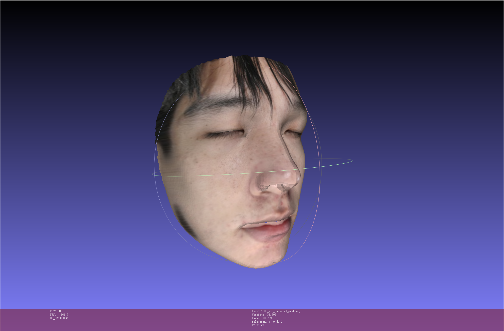

# 3DMM fitting throw three images

This project leverages PyTorch and 3D Morphable Models (3DMM) to reconstruct a high-fidelity 3D face from three input images taken from different viewpoints (`mid`, `left`, and `right`). The pipeline includes image preprocessing, multi-view parameter fitting, and final mesh generation with texture baking. With only three facial images, it produces a fully textured 3D face model ready for rendering or editing.


## Installation
### Requirements
- [pytorch3d](https://github.com/facebookresearch/pytorch3d) It might require a specific version of Pytorch to make pytorch3d run succussfully on gpus, please follow the official instructions.
- Please refer to "requirements.txt" for other dependences.
- [Basel Face Model 2009 (BFM09)](https://faces.dmi.unibas.ch/bfm/index.php?nav=1-2&id=downloads)
- [Expression Basis](https://github.com/Juyong/3DFace) extra expression basis.

## How to use
### Installation
1. Clone the repo:

2. Download the Basel Face Model and put "01_MorphableModel.mat" and put it into "BFM".

3. Download the Expression Basis. Go to the [repo](https://github.com/Juyong/3DFace), download the "CoarseData" and put "Exp_Pca.bin" into "BFM".

4. Convert the BFM parameters by:
```
python convert_bfm09_data.py
```

### Single Image Reconstruction

To put your image as the follow tree

```
dataset/
└── 1101/
    ├── mid/
    │   ├── img1.jpg
    │   ├── img2.png
    │   └── ...
    ├── left/
    │   ├── img1.jpg
    │   ├── img2.png
    │   └── ...
    └── right/
        ├── img1.jpg
        ├── img2.png
        └── ...
```

Run run_pipeline.py to run whole pipeline.For example

```
python run_pipeline.py --id 1101
```
The results are default stored in "results" folder.

## Results

[3dmm fitting video](./display/_interp.mp4)




## Acknowledgement
The code is partially borrowed from [3DMM-Fitting-Pytorch](https://github.com/ascust/3DMM-Fitting-Pytorch), which is a This is a fitting framework implemented in Pytorch for reconstructing the face in an image or a video using a 3DMM model.We estimate the parameters directly using the landmarks and photometric loss as the supervision.
